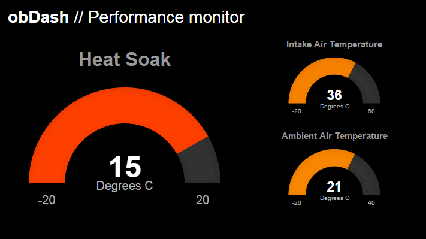

# obDash



Some test code for OBD logging and display for my little Toyota.

# Note

This is a sandbox. Nothing here is "expected to work", but if there's something you
like, have fun with it.

# Setup

## Raspbian on Raspberry Pi

Run this in the root of the clone of this repo.

```sh
sudo apt-get -y install python-dev
sudo apt-get -y install python-pip
pip install virtualenv
virtualenv venv
sudo venv/bin/pip install -r requirements.txt
venv/bin/python src/runserver.py
```

The gevent install bit takes forever...

# Applications

obDash is built to support "apps" that you can build and include. These apps make use of an "obdash" JavaScript API.

Have a look at [the debug app](src/obdash/apps/debug/index.html) for a good example of how this works. Each app also needs and icon, which is in the same folder as above. Apps are dynamically loaded when the web server is launched.

# Licence

[MIT](LICENCE)
